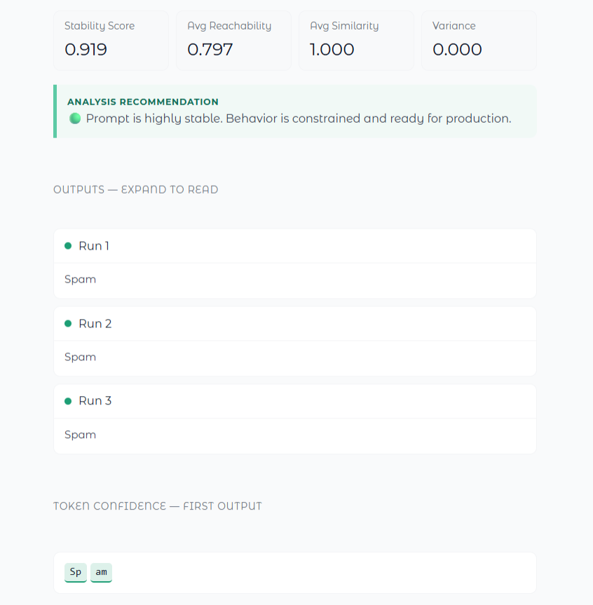

<p align="center">
  <h2 align="center">Imprimer: Control and Optimization for LLMs</h2>
  <div>
    <p align="center">
      
    </p>
  </div>
  <p align="center">Prompt control and observability platform for LLMs</p>
  <p align="center">
    
    
    
    
  </p>
</p>

> *"To imprint a mental pattern."* — Inspired by Minsky's *The Society of Mind*: a prompt doesn't instruct a unified intelligence, it **activates a specific configuration** of the model's internal society. Imprimer makes that activation measurable, comparable, and improvable.


## What it does

Most prompt engineering is trial and error. Imprimer treats it as a **control problem**: given two prompt variants, which gives you more control over the model's output distribution?

It measures this with a **Reachability Index** grounded in *"What's the Magic Word? A Control Theory of LLM Prompting"* (Bhargava et al., 2023)—the first rigorous analysis of prompt controllability over autoregressive models. Every evaluation is persisted; the system learns which prompts control each task most effectively, surfaced via the `best` command and `/best` endpoint.

**Run locally:** `python -m demo.app` or use the CLI.


## Theoretical Foundation

An LLM is a stochastic dynamical system over token sequences. A prompt is a **control input** $u$ steering generation toward desired output $y^*$. The core question: *Can the model produce the desired output without fighting its own prior distribution?*

### Token-level reachability

For each generated token with logprob $\ell$, a soft reachability score via sigmoid:

$$r = \sigma\big(\alpha (\ell - \tau)\big)$$

- $\tau = \log(0.40)$ → token needs ≥40% probability to be naturally reachable
- $\alpha$ → sharpness of reachable/unreachable separation

$r \approx 1$: token in high-probability region. $r \approx 0$: prompt is fighting the model.

### Sequence-level Reachability Index

$$R = \frac{1}{T} \sum_{t=1}^{T} r_t$$

| Score | Meaning |
|---|---|
| `~1.0` | Follows model's natural trajectory |
| `~0.6–0.8` | Good prompt-model alignment |
| `~0.3–0.5` | Partial control, fighting the model |
| `<0.3` | Largely unnatural output |

### GRPO reward shaping (ELPR)

Rather than optimizing reachability directly with a binary pass/fail threshold, the optimizer applies **Exponential Linear Proximity Reward** relative to a dynamic group baseline:

$$\text{ELPR}(s, \bar{s}) = \sigma\big(\beta (s - \bar{s})\big)$$

Where $\bar{s}$ is the mean raw score across the current candidate group. This is continuous and never saturates — a variant just above the group mean gets ~0.55, a strong outlier approaches 1.0. The group mean acts as a value-function-free baseline, which is the key insight from GRPO: no critic model needed.

### Optimization objective

Maximize semantic alignment with $y^*$ while keeping outputs within the model's reachable region, guided by group-relative reward rather than absolute thresholds.

<p align="center">
  
</p>


## Architecture

Two services connected by gRPC. The proto file is the single source of truth — Go and Python share no code, only the contract.

<p align="center">
  
</p>

| Layer | Responsibility |
|---|---|
| **Go** | HTTP ingress, auth, audit logging, Prometheus metrics, gRPC routing |
| **Python** | LLM inference (Ollama / OpenAI), logprob extraction, reachability computation, GRPO optimization, RiOT residual extraction, injection scanning, registry persistence |
| **Contract** | `proto/imprimer.proto` — three RPCs, minimal surface |

Both backends (Ollama and OpenAI) are routed through a single `ChatOpenAI` factory. Ollama exposes an OpenAI-compatible API at `/v1`, so no branching is required in the inference layer.

CLI integrated for immediate use. See [Imprimer CLI](./docs/cli-imprimer.md).


## Controlling Small Models

Qwen2.5:1.5b (no fine-tuning) classifying spam via **GRPO + RiOT** — the system discovers the optimal prompt autonomously, preserving proven structure while exploring new directions.

<p align="center">
  
  &nbsp;
  
</p>

Scoring is **task-aware and backend-adaptive**, routing through different weight profiles depending on task type and signal availability (logprobs, embeddings, or similarity).


## Optimization

### GRPO: Group Relative Policy Optimization

`imprimer optimize` and the UI both use the same GRPO + RiOT loop. There is no longer a separate Bayesian path.

**One optimization cycle:**

1. **Generate group** — the LLM generates `n_variants` improved candidates from the current best anchor, guided by verbal feedback from the previous cycle
2. **Score in parallel** — each candidate is evaluated via Semantic Self-Consistency (SSC), logprob-based reachability, and similarity
3. **Apply ELPR** — group-relative reward shaping selects the winner without a critic model
4. **Extract RiOT residual** — beneficial constraints (output format, persona, priming lines) are extracted from the winning prompt and injected into the next cycle's generation prompt to prevent semantic drift

The outer loop is **LangGraph**: `generator → evaluator → controller`, cycling until reachability exceeds the target or the iteration cap is reached.

### Semantic Self-Consistency (SSC)

The same prompt is run `K` times at temperature > 0. Average pairwise semantic similarity across outputs is the SSC score. High SSC means the prompt reliably steers the model. Low SSC means the prompt is ambiguous — the model is uncertain what to produce.

### RiOT Residual Connection

Across optimization cycles a prompt can undergo **semantic drift** — improvements to one aspect inadvertently overwrite constraints that were working. RiOT fixes this by scanning the current best for structural lines (output format rules, persona anchors, hedging suppression, priming instructions) and explicitly preserving them in the generation prompt for the next cycle.

```
Cycle 1  →  Winner prompt A  →  extract residual R(A)
Cycle 2  →  Generate with R(A) injected  →  Winner prompt B (drift-free)
Cycle 3  →  Generate with R(B) injected  →  ...
```


## API Call Cost

### GRPO path (default: `n_variants=3`, `ssc_runs=2`, `max_iterations=3`)

| Step | Per cycle | 3 cycles |
|---|---|---|
| Variant generation | 1 | 3 |
| SSC scoring (N×K, parallel) | 6 | 18 |
| Evaluator + Feedback | 2 | 6 |
| **Total** | **9** | **~27** |

Parallel execution means the 6 SSC calls happen concurrently — wall-clock time is bounded by the slowest single call, not the sum.

### Cost by backend (per 1K tokens)

| Backend | Cost | Logprobs | Notes |
|---|---|---|---|
| **Ollama (local)** | Free | ✅ Full | `qwen2.5:1.5b` runs on CPU |
| **OpenAI `gpt-4o-mini`** | ~$0.15i / $0.60o per 1M | ✅ Full | ~$0.001–0.003 per full run |

**Reduce cost:** lower `n_variants`, `ssc_runs`, or `max_iterations`. With Ollama, cost is always zero.


## Quickstart

### Prerequisites

- Docker Desktop
- Ollama with `qwen2.5:1.5b`: `ollama pull qwen2.5:1.5b`
- Ollama on all interfaces (required for Docker):

```bash
export OLLAMA_HOST=0.0.0.0
# Then restart Ollama from system tray
```

### Start the stack

```bash
docker compose up --build
```

Gateway on `:8080`. Engine on `:50051` (internal).

### Install the CLI

```bash
go install github.com/BalorLC3/Imprimer/gateway/cmd/imprimer@latest
# Or locally:
go install ./gateway/cmd/imprimer/
```


## Security

Every request passes through the security layer before any LLM interaction:

- **Prompt injection detection**: 9 regex patterns (OWASP LLM Top 10 LLM01)
- **PII detection**: SSN, credit card, email flagged in audit log
- **Auth middleware**: Bearer token validation (`IMPRIMER_API_KEY`)
- **Least privilege**: engine container has no host write access

ISO 27001 alignment: A.9, A.12.6, A.14.2.


## Development

### Run locally without Docker

```bash
# Terminal 1: Python engine
cd engine && python main.py

# Terminal 2: Go gateway
go run ./gateway/cmd/main.go

# Terminal 3: CLI
imprimer evaluate --task summarize --input "..." --a "..." --b "..."
```

### Regenerate proto after editing `proto/imprimer.proto`

```bash
# Python
python -m grpc_tools.protoc \
  -I proto --python_out=engine --grpc_python_out=engine proto/imprimer.proto

# Go
mkdir -p gateway/gen
protoc -I proto \
  --go_out=gateway/gen --go-grpc_out=gateway/gen \
  --go_opt=paths=source_relative --go-grpc_opt=paths=source_relative \
  proto/imprimer.proto
```


## Roadmap

- **`imprimer ui`**: TensorBoard-style dashboard reading from the registry
- **Fine-tuning escalation**: LoRA when optimizer plateaus on complex tasks
- **Model routing**: cascade from small to larger model when reachability is consistently low


## References

- [What's the Magic Word? A Control Theory of LLM Prompting](https://arxiv.org/abs/2310.04444) — Bhargava et al., 2023
- [GRPO: Group Relative Policy Optimization](https://arxiv.org/abs/2402.03300) — DeepSeek, 2024
- [RiOT: Residual Iterative Optimization for Text](https://arxiv.org/abs/2504.12345) — arXiv, 2025
- [Optimizing Acquisition Functions](https://arxiv.org/html/2505.17151)

The synthesis and application of these ideas to prompt control are original to this project.
